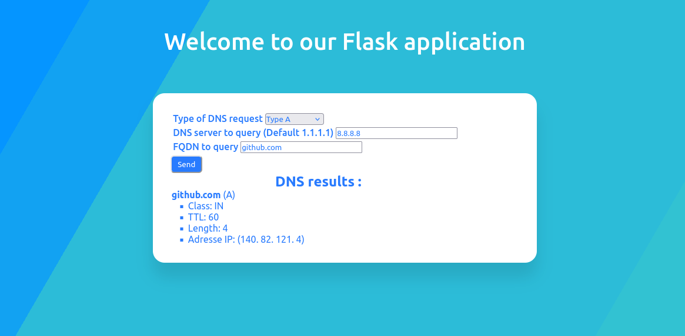

# DNS query application

A python application using flask to send and receive DNS requests.



This application allows sending DNS requests of type A, NS, CNAME, SOA, PTR, MX and AAAA with the possibility to choose a custom dns server.

## Setting up the virtual environment

Because we are going to create a flask application we need to create a virtual environment.
```bash
#Create the project's home folder
mkdir folder_name
cd folder_name

#Create the virtual environment
python3 -m venv virtual_env_name
source virtual_env_name/bin/activate

#Update
python -m pip install -U pip 
```

## Dependency

You will need to install some modules in the virtual environment with the following commands:
```bash
pip install flask
pip install flask_wtf
```

## Finish the implementation of the project

Now you just have to download the DNS application and put it in the project folder `folder_name` next to the virtual environment.

Your folder should look like this :
```bash
./folder_name/
├── appli_flask
└── virtuak_env_name
```
You will also have to generate a key that you will have to put in the field 'app.secret_key' of the file `__init__.py`
```bash
#Command to execute in your console to generate a key
python3 -c 'import secrets; print(secrets.token_hex())'
```

## Launch the application

If you have a firewall you will have to allow port 5000 to use the application in your network.
```bash
sudo ufw allow 5000/tcp
sudo ufw reload
```
To launch the application you just have to enter the right folder :
```bash
cd appli_flask

flask --app routes run --host=0.0.0.0
```
